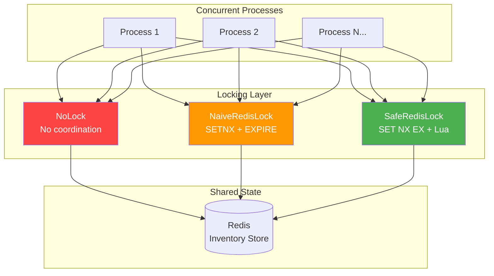
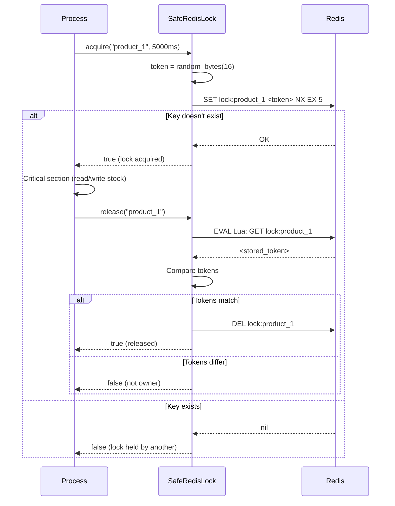

# 🔐 Distributed Locking Deep Dive Lab

[](https://www.php.net/)
[](https://redis.io/)
[](https://docs.docker.com/compose/)
[](LICENSE)

A deep technical exploration of **distributed locking strategies** using Redis.  
This is not a framework-based demo — it is a **systems engineering lab** focused on correctness, reliability, and distributed safety.

---

## 🧠 Overview

This project demonstrates:

| Concept | What You'll See |
|---------|-----------------|
| **Race Conditions** | Multiple processes corrupt shared state without coordination |
| **Overselling** | Stock goes negative when locking is absent |
| **Naive Lock Pitfalls** | SETNX + EXPIRE gap, no ownership, crash vulnerability |
| **Safe Redis Locks** | SET NX EX + Lua release — atomic, owned, TTL-protected |
| **Deadlock** | Circular wait between two resources |
| **TTL Expiration Edge Cases** | Lock expires mid-operation, two processes enter critical section |
| **Retry Strategies** | Fixed vs Exponential Backoff vs Exponential + Jitter |
| **Redis Lock vs DB Row Lock** | Trade-offs and when to use each |

---

## 🎯 Problem Statement

In distributed systems, multiple processes may attempt to modify shared state concurrently.

```
Product stock = 1
100 concurrent purchase attempts
Without coordination → stock becomes negative → OVERSELLING
```

This lab demonstrates:
1. **What happens** without locking (race conditions, lost updates)
2. **Why naive locking fails** (non-atomic operations, no ownership)
3. **How to implement safe distributed locks** (SET NX EX + Lua)
4. **Where safe locks can still fail** (TTL expiration edge cases)
5. **How to mitigate those failures** (TTL tuning, fencing tokens, deterministic ordering)

---

## 🏗 Project Structure

```
distributed-locking-lab/
├── src/
│   ├── Lock/
│   │   ├── LockInterface.php          # Contract for all locking strategies
│   │   ├── NoLock.php                  # No-op baseline (no coordination)
│   │   ├── NaiveRedisLock.php          # SETNX + EXPIRE (intentionally unsafe)
│   │   └── SafeRedisLock.php           # SET NX EX + Lua release (production-grade)
│   │
│   ├── Simulation/
│   │   ├── OversellSimulator.php       # Race condition & overselling demo
│   │   ├── DeadlockSimulator.php       # Circular wait demonstration
│   │   ├── CrashScenarioSimulator.php  # Crash recovery & TTL edge cases
│   │   └── RetrySimulator.php          # Retry strategy comparison
│   │
│   └── Core/
│       ├── Inventory.php               # Redis-backed stock management
│       ├── OrderProcessor.php          # Purchase coordinator (lock → check → decrement)
│       ├── Logger.php                  # Structured simulation logger
│       └── RedisFactory.php            # Redis connection factory
│
├── bin/
│   ├── oversell.php                    # CLI: Run overselling simulation
│   ├── deadlock.php                    # CLI: Run deadlock simulation
│   ├── crash.php                       # CLI: Run crash/TTL simulation
│   ├── retry.php                       # CLI: Run retry comparison
│   ├── run-all.php                     # CLI: Run ALL simulations
│   └── http-server.php                 # HTTP facade for k6 load tests
│
├── load-tests/
│   ├── oversell-test.js                # k6: 50 VUs race for stock=1
│   ├── high-load-test.js              # k6: Sustained 100 VUs load test
│   └── retry-comparison-test.js        # k6: Burst vs ramped contention
│
├── docker-compose.yml                  # PHP 8.4 CLI + Redis 7
├── Dockerfile
├── composer.json
└── README.md
```

---

## 🧪 Simulation Scenarios

### 1️⃣ No Lock — Baseline Race Condition

**Setup**: 50 concurrent processes, stock = 1

```
Process A: GET stock → 1
Process B: GET stock → 1      ← both see 1
Process A: SET stock → 0
Process B: SET stock → 0      ← lost update!
```

**Expected Result**: Multiple successful decrements, stock becomes negative.

```bash
docker compose exec app php bin/oversell.php --lock=none --stock=1 --concurrency=50
```

**Expected Output**:
```
🔬 Starting: Oversell Test (50 processes, stock=1)
🔐 Strategy: NoLock (Baseline — No Coordination)

╔══════════════════════════════════════════════════════════╗
║              SIMULATION RESULTS                         ║
╠══════════════════════════════════════════════════════════╣
║  Scenario:        Oversell Test (50 processes, stock=1) ║
║  Lock Strategy:   NoLock (Baseline — No Coordination)   ║
╠══════════════════════════════════════════════════════════╣
║  Total Attempts:    50                                  ║
║  Successful:        38                                  ║
║  Failed (stock):    12                                  ║
║  Failed (lock):     0                                   ║
╠══════════════════════════════════════════════════════════╣
║  Initial Stock:     1                                   ║
║  Final Stock:       -37                                 ║
║  Expected Stock:    0                                   ║
╚══════════════════════════════════════════════════════════╝

  ⚠️  OVERSELLING DETECTED!
     Stock went negative or more orders succeeded than available stock.
     This proves the locking strategy is UNSAFE.
```

---

### 2️⃣ Naive Redis Lock (SETNX + EXPIRE)

**Implementation**:
```php
// Step 1: SETNX (Set if Not eXists)
$redis->setnx($key, '1');

// Step 2: EXPIRE — NOT atomic with SETNX!
// ⚠️  If crash happens HERE, lock has no TTL → permanent deadlock
$redis->expire($key, 5);
```

**Vulnerabilities demonstrated**:
| Problem | Explanation |
|---------|-------------|
| Non-atomic SET + EXPIRE | Crash between them → lock with no TTL → permanent deadlock |
| No ownership token | Any process can release any lock |
| No token validation on release | `DEL lock_key` — unconditional, unsafe |
| Lock expiration mid-operation | TTL expires before work completes |

```bash
docker compose exec app php bin/oversell.php --lock=naive --stock=1 --concurrency=50
```

---

### 3️⃣ Safe Redis Lock with Token

**Implementation**:
```php
// Acquire: Single atomic command
SET lock_key <unique_token> NX EX <ttl>

// Release: Lua script (atomic compare-and-delete)
if redis.call("GET", KEYS[1]) == ARGV[1] then
    return redis.call("DEL", KEYS[1])
else
    return 0
end
```

**Safety Properties**:
| Property | How It's Achieved |
|----------|-------------------|
| Atomic SET + TTL | Single `SET NX EX` command — no crash gap |
| Ownership | Random token per acquisition (`bin2hex(random_bytes(16))`) |
| Safe release | Lua script: compare token → delete only if owner |
| Deadlock prevention | TTL auto-expires lock if holder crashes |

```bash
docker compose exec app php bin/oversell.php --lock=safe --stock=1 --concurrency=50
```

**Expected Output**:
```
🔬 Starting: Oversell Test (50 processes, stock=1)
🔐 Strategy: Safe Redis Lock (SET NX EX + Lua Release)

╔══════════════════════════════════════════════════════════╗
║              SIMULATION RESULTS                         ║
╠══════════════════════════════════════════════════════════╣
║  Total Attempts:    50                                  ║
║  Successful:        1                                   ║
║  Failed (stock):    0                                   ║
║  Failed (lock):     49                                  ║
╠══════════════════════════════════════════════════════════╣
║  Initial Stock:     1                                   ║
║  Final Stock:       0                                   ║
║  Expected Stock:    0                                   ║
╚══════════════════════════════════════════════════════════╝

  ✅ NO OVERSELLING — Locking strategy is CORRECT for this scenario.
```

---

### 4️⃣ TTL Expiration Edge Case

**Scenario**: Lock TTL (1s) shorter than critical section (3s).

```
Timeline:
├── 0ms       Process A acquires lock (TTL=1000ms)
├── 0ms       Process A starts work (3000ms)
├── 1000ms    ⚠️  Lock EXPIRES (Process A still working!)
├── 1000ms    Process B acquires lock (key is free)
├── 1000ms    Process B reads stock=1, decrements to 0
├── 3000ms    Process A finishes, decrements stock to -1
└── RESULT:   Stock = -1 (OVERSOLD!) ⚠️
```

```bash
docker compose exec app php bin/crash.php --ttl-edge --ttl=1000 --work=3000
```

**Key Takeaway**: Even "safe" locks can fail if TTL < execution time.

---

### 5️⃣ Deadlock Scenario

**Setup**: Two resources, two processes, opposite lock ordering.

```
Process 1: Lock A → (wait B) ──┐
Process 2: Lock B → (wait A) ──┘ DEADLOCK!
```

**Without mitigation**:
```bash
docker compose exec app php bin/deadlock.php
```

**With mitigation** (sorted resource ordering):
```bash
docker compose exec app php bin/deadlock.php --mitigate
```

**Mitigation**: Sort resource IDs alphabetically before acquiring locks.  
Both processes lock `[A, B]` in the same order → no circular wait.

---

### 6️⃣ Retry Strategy Comparison

Tests three approaches under lock contention:

| Strategy | Delay Pattern | Characteristic |
|----------|---------------|----------------|
| **Fixed** | 100ms, 100ms, 100ms, ... | Synchronized retries → thundering herd |
| **Exponential Backoff** | 100ms, 200ms, 400ms, 800ms, ... | Spreading out → less contention |
| **Exponential + Jitter** | random(0, backoff), ... | Desynchronized → optimal throughput |

```bash
docker compose exec app php bin/retry.php --concurrency=20 --stock=10
```

**Expected Output**:
```
╔══════════════════════════════════════════════════════════════════════════════╗
║                    RETRY STRATEGY COMPARISON                                ║
╠═══════════════════════════╦════════════╦════════════╦════════════╦═══════════╣
║ Strategy                  ║ Duration   ║ Successes  ║ Avg Retry  ║ Fairness  ║
╠═══════════════════════════╬════════════╬════════════╬════════════╬═══════════╣
║ Fixed Delay (100ms)       ║ 2847ms     ║ 10         ║ 3.2        ║ 245.3ms   ║
║ Exponential Backoff       ║ 2134ms     ║ 10         ║ 2.1        ║ 189.7ms   ║
║ Exponential Backoff + Jit ║ 1576ms     ║ 10         ║ 1.4        ║ 98.2ms    ║
╚═══════════════════════════╩════════════╩════════════╩════════════╩═══════════╝

💡 Key Insight:
   Exponential Backoff + Jitter typically wins because:
   1. Exponential spacing reduces collision probability
   2. Jitter breaks synchronization (thundering herd prevention)
   3. Combined → less wasted work, more throughput, fairer access
```

---

## 🔬 Experimental Design

Each simulation logs:

| Field | Description |
|-------|-------------|
| `process_id` | Unique process identifier |
| `lock_acquired` | Whether the lock was obtained |
| `stock_before` | Stock level at time of read |
| `stock_after` | Stock level after operation |
| `duration_ms` | Execution time in milliseconds |
| `success` | Whether the operation succeeded |
| `error` | Error description (if any) |

All simulations are **reproducible** using Docker — same Redis version, same PHP version, same OS.

---

## 🧱 Core Concepts Demonstrated

### Race Condition
Multiple processes read the same stock value, both decrement it, resulting in a **lost update**.  
The read-modify-write pattern without coordination is fundamentally unsafe.

### Mutual Exclusion
Only one process may execute the critical section at a time.  
Achieved via distributed locks (Redis `SET NX EX`).

### Lock Ownership
Locks must be released **only by the owner**. Without ownership tokens, Process B can accidentally release Process A's lock.  
Solved via unique tokens + Lua compare-and-delete.

### Deadlock
Two processes wait indefinitely for each other — circular dependency.  
Prevented by deterministic lock ordering (sort resource IDs).

### TTL Safety
Lock TTL must exceed the maximum critical section duration.  
If TTL < execution time, the lock expires and another process enters — safety violation.

### At-Least-Once Execution
In distributed systems, operations may execute more than once (retries after timeout).  
Must design for **idempotency**.

---

## 🔐 Locking Strategies Compared

| Strategy | Safe | Crash Resistant | Deadlock Safe | Production Ready |
|----------|------|-----------------|---------------|------------------|
| **No Lock** | ❌ | ❌ | ❌ | ❌ |
| **Naive SETNX** | ⚠️ | ❌ | ❌ | ❌ |
| **Safe Redis Lock** | ✅ | ⚠️ (TTL-dependent) | ⚠️ (needs ordering) | ✅ (single instance) |

### Why Each Strategy Fails or Succeeds

```
NoLock
├── No coordination at all
├── Race condition guaranteed under contention
└── Overselling: YES

NaiveRedisLock (SETNX + EXPIRE)
├── Two separate commands (non-atomic)
├── Crash between SETNX and EXPIRE → permanent deadlock
├── No ownership → any process can release any lock
└── Overselling: SOMETIMES (depends on timing)

SafeRedisLock (SET NX EX + Lua)
├── Single atomic command for acquire
├── Token-based ownership
├── Lua-based atomic compare-and-delete for release
├── TTL prevents permanent deadlocks
└── Overselling: NO (when TTL > execution time)
```

---

## ⚖️ Trade-offs: Redis Lock vs DB Row Lock

| Aspect | Redis Lock | DB Row Lock (`SELECT ... FOR UPDATE`) |
|--------|-----------|---------------------------------------|
| **Speed** | ~0.1ms (in-memory) | ~1-5ms (disk I/O) |
| **Cross-service** | ✅ Any service with Redis access | ❌ Only within same DB connection |
| **Consistency** | Eventual (TTL-based) | Strong (transaction-scoped) |
| **Failure mode** | Lock may outlive TTL | Transaction rollback on crash |
| **Contention** | Low (in-memory) | Higher (row-level blocking) |
| **Complexity** | Requires TTL management | Built into RDBMS |

### Why Not Redlock?

Redlock attempts to improve reliability using multiple Redis nodes.  
However:
- Requires multi-node Redis setup (3+ nodes)
- Increased operational complexity
- Debated correctness under network partitions ([Martin Kleppmann's analysis](https://martin.kleppmann.com/2016/02/08/how-to-do-distributed-locking.html))

For this lab, a **single Redis instance** is sufficient to demonstrate all locking concepts.

---

## 🐳 Running the Lab

### Prerequisites

- Docker & Docker Compose
- (Optional) [k6](https://k6.io/) for load testing

### Quick Start

```bash
# Clone the repository
git clone https://github.com/AbdouShalby/Distributed-Locking-Deep-Dive-Lab.git
cd Distributed-Locking-Deep-Dive-Lab

# Start containers (PHP 8.4 CLI + Redis 7)
docker compose up -d --build

# Install dependencies
docker compose exec app composer install

# Run all simulations
docker compose exec app php bin/run-all.php
```

### Individual Simulations

```bash
# Overselling — compare all 3 strategies
docker compose exec app php bin/oversell.php --all

# Overselling — specific strategy
docker compose exec app php bin/oversell.php --lock=none
docker compose exec app php bin/oversell.php --lock=naive
docker compose exec app php bin/oversell.php --lock=safe
docker compose exec app php bin/oversell.php --lock=safe --stock=5 --concurrency=100

# Deadlock
docker compose exec app php bin/deadlock.php                 # Shows deadlock
docker compose exec app php bin/deadlock.php --mitigate      # Shows fix

# Crash recovery & TTL edge case
docker compose exec app php bin/crash.php                    # Crash recovery
docker compose exec app php bin/crash.php --ttl-edge         # TTL < work duration

# Retry strategy comparison
docker compose exec app php bin/retry.php
docker compose exec app php bin/retry.php --concurrency=30 --stock=15
```

### k6 Load Tests

```bash
# Start the HTTP test server
docker compose exec -d app php bin/http-server.php

# Run k6 tests (from host machine)
k6 run load-tests/oversell-test.js
k6 run load-tests/high-load-test.js
k6 run load-tests/retry-comparison-test.js

# Export results to JSON
k6 run --out json=results/oversell.json load-tests/oversell-test.js
```

---

## 📊 Results Documentation

Each simulation produces a structured report:

| Metric | Description |
|--------|-------------|
| Total concurrent processes | How many processes raced |
| Success count | Purchases that succeeded |
| Failure count | Purchases rejected (stock or lock) |
| Final stock value | Actual remaining stock |
| Lock contention rate | % of attempts that failed to acquire lock |
| Total duration | Wall-clock time for entire simulation |

Export results to JSON:
```bash
docker compose exec app php bin/oversell.php --lock=safe --output=results/safe_lock.json
```

---

## 🧠 Key Engineering Takeaways

1. **Distributed locking must use ownership tokens** — without them, any process can release any lock
2. **TTL must exceed maximum critical section duration** — otherwise the lock expires mid-operation
3. **Locks alone are insufficient** — combine with transaction protection (DB constraints, Lua atomicity)
4. **Retry strategy must include backoff + jitter** — fixed retries cause thundering herd
5. **Deadlocks must be prevented via deterministic ordering** — always sort resource IDs
6. **Distributed systems require layered protection** — Redis lock + DB row lock + application-level checks

---

## 🚀 Production Recommendations

In real production systems:

| Layer | Protection |
|-------|-----------|
| **Application** | Redis distributed lock with ownership token |
| **Database** | Row-level lock (`SELECT ... FOR UPDATE`) as second barrier |
| **Monitoring** | Track lock contention rate, TTL violations, retry counts |
| **Circuit Breaker** | Prevent cascading failures in payment-like flows |
| **Alerting** | Alert on unusual retry patterns or lock hold times |
| **Idempotency** | Design all operations to be safely re-executable |

---

## 📌 Future Improvements

- [ ] Multi-node Redlock demo (3 Redis instances)
- [ ] Prometheus metrics + Grafana visualization dashboard
- [ ] Benchmark comparisons (Redis lock vs Postgres advisory locks)
- [ ] Fencing token implementation for at-most-once execution
- [ ] Leader election demo using distributed locks

---

## 🔗 Architecture Diagrams

### System Overview



### Lock Acquisition Flow



### Race Condition Timeline

```mermaid
gantt
    title No Lock: Race Condition
    dateFormat X
    axisFormat %L

    section Process A
    GET stock=1       :a1, 0, 10
    (delay)           :a2, 10, 30
    SET stock=0       :a3, 30, 40

    section Process B
    GET stock=1       :b1, 5, 15
    (delay)           :b2, 15, 35
    SET stock=0       :b3, 35, 45

    section Result
    Both see stock=1  :crit, r1, 0, 15
    Both decrement    :crit, r2, 30, 45
```



---

## 📚 Conclusion

This lab demonstrates practical distributed locking techniques and their failure modes.  
It is designed to showcase:

- **Systems thinking** — understanding concurrent access patterns
- **Concurrency awareness** — knowing where race conditions hide
- **Failure handling** — designing for crashes, timeouts, and deadlocks
- **Distributed design trade-offs** — Redis vs DB locks, TTL vs availability

**This is not a framework showcase. It is an engineering correctness lab.**

---

## License

MIT
