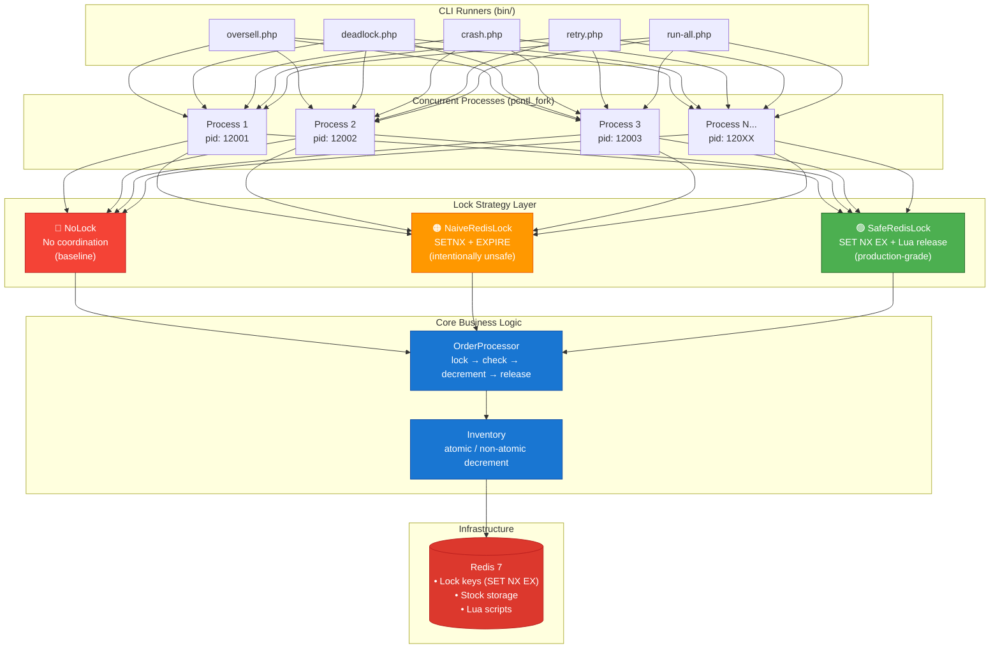

# System Architecture

```mermaid
graph TB
    subgraph "Concurrent Processes (pcntl_fork)"
        P1["Process 1<br/>pid: 12001"]
        P2["Process 2<br/>pid: 12002"]
        P3["Process 3<br/>pid: 12003"]
        PN["Process N...<br/>pid: 120XX"]
    end

    subgraph "Lock Strategy Layer"
        direction TB
        NL["🔴 NoLock<br/>No coordination<br/>(baseline)"]
        NRL["🟠 NaiveRedisLock<br/>SETNX + EXPIRE<br/>(intentionally unsafe)"]
        SRL["🟢 SafeRedisLock<br/>SET NX EX + Lua release<br/>(production-grade)"]
    end

    subgraph "Core Business Logic"
        OP["OrderProcessor<br/>lock → check → decrement → release"]
        INV["Inventory<br/>atomic / non-atomic decrement"]
    end

    subgraph "Infrastructure"
        R[("Redis 7<br/>• Lock keys (SET NX EX)<br/>• Stock storage<br/>• Lua scripts")]
    end

    subgraph "CLI Runners (bin/)"
        R1["oversell.php"]
        R2["deadlock.php"]
        R3["crash.php"]
        R4["retry.php"]
        R5["run-all.php"]
    end

    R1 & R2 & R3 & R4 & R5 --> P1 & P2 & P3 & PN
    P1 & P2 & P3 & PN --> NL & NRL & SRL
    NL & NRL & SRL --> OP
    OP --> INV
    INV --> R

    style NL fill:#f44336,color:#fff,stroke:#b71c1c
    style NRL fill:#ff9800,color:#fff,stroke:#e65100
    style SRL fill:#4caf50,color:#fff,stroke:#1b5e20
    style R fill:#dc382d,color:#fff,stroke:#b71c1c
    style OP fill:#1976d2,color:#fff,stroke:#0d47a1
    style INV fill:#1976d2,color:#fff,stroke:#0d47a1
```
