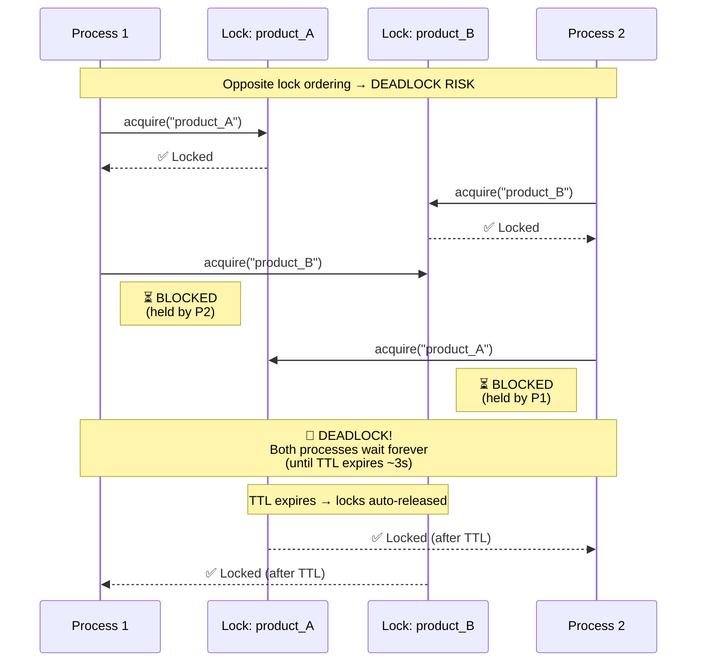
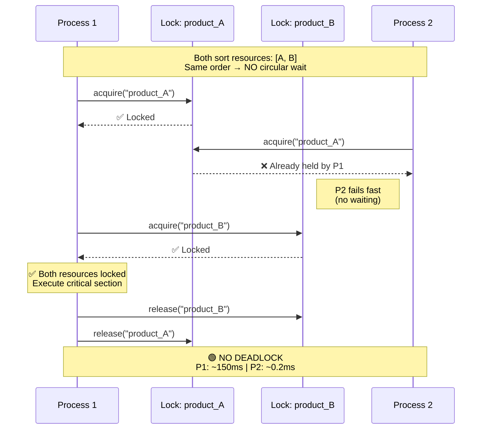

# Deadlock Flow

## Without Mitigation (Circular Wait → Deadlock)

```mermaid
sequenceDiagram
    participant P1 as Process 1
    participant RA as Lock: product_A
    participant RB as Lock: product_B
    participant P2 as Process 2

    Note over P1,P2: Opposite lock ordering → DEADLOCK RISK

    P1->>RA: acquire("product_A")
    RA-->>P1: ✅ Locked

    P2->>RB: acquire("product_B")
    RB-->>P2: ✅ Locked

    P1->>RB: acquire("product_B")
    Note right of P1: ⏳ BLOCKED<br/>(held by P2)

    P2->>RA: acquire("product_A")
    Note left of P2: ⏳ BLOCKED<br/>(held by P1)

    Note over P1,P2: 🔴 DEADLOCK!<br/>Both processes wait forever<br/>(until TTL expires ~3s)

    Note over RA,RB: TTL expires → locks auto-released
    RA-->>P2: ✅ Locked (after TTL)
    RB-->>P1: ✅ Locked (after TTL)
```

## With Mitigation (Sorted Ordering → No Circular Wait)

```mermaid
sequenceDiagram
    participant P1 as Process 1
    participant RA as Lock: product_A
    participant RB as Lock: product_B
    participant P2 as Process 2

    Note over P1,P2: Both sort resources: [A, B]<br/>Same order → NO circular wait

    P1->>RA: acquire("product_A")
    RA-->>P1: ✅ Locked

    P2->>RA: acquire("product_A")
    RA-->>P2: ❌ Already held by P1

    Note left of P2: P2 fails fast<br/>(no waiting)

    P1->>RB: acquire("product_B")
    RB-->>P1: ✅ Locked

    Note over P1: ✅ Both resources locked<br/>Execute critical section

    P1->>RB: release("product_B")
    P1->>RA: release("product_A")

    Note over P1,P2: 🟢 NO DEADLOCK<br/>P1: ~150ms | P2: ~0.2ms
```
