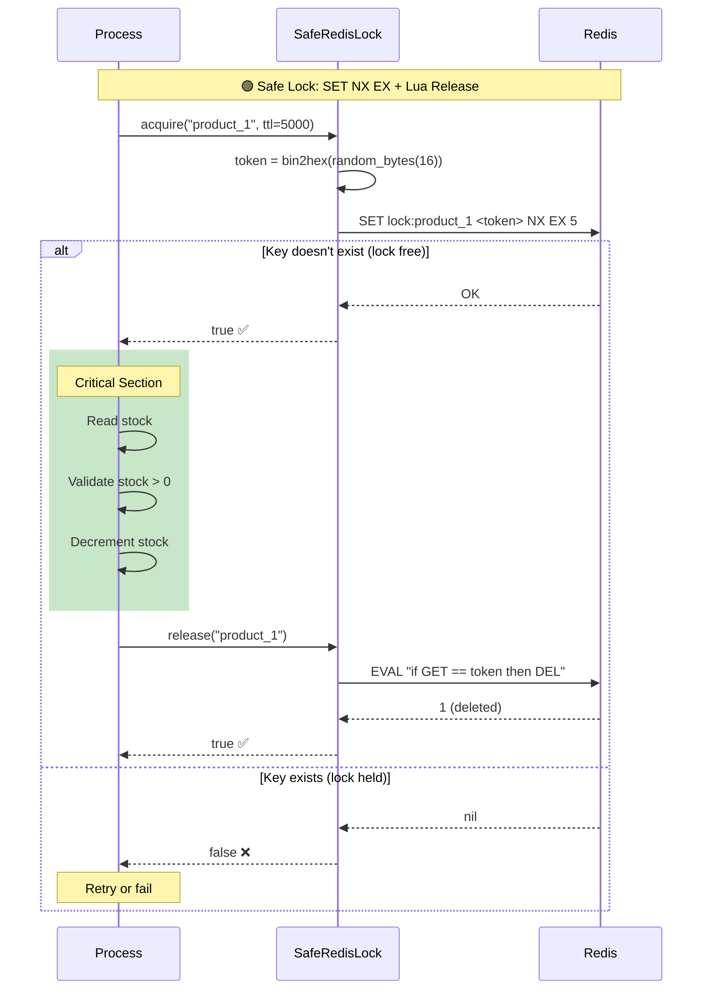

# Lock Strategy Comparison

## Lock Acquisition & Release Flow

## Why Each Strategy Fails or Succeeds

```mermaid
graph TD
    subgraph "🔴 NoLock"
        NL1["No coordination"] --> NL2["All processes enter<br/>critical section"]
        NL2 --> NL3["Read-Modify-Write<br/>race condition"]
        NL3 --> NL4["❌ OVERSELLING<br/>stock = -37"]
    end

    subgraph "🟠 NaiveRedisLock"
        NV1["SETNX key 1"] --> NV2["EXPIRE key 5"]
        NV2 --> NV3["💥 Crash between<br/>SETNX and EXPIRE?"]
        NV3 -->|Yes| NV4["❌ Lock without TTL<br/>= permanent deadlock"]
        NV3 -->|No| NV5["DEL key<br/>(no ownership check)"]
        NV5 --> NV6["⚠️ Any process can<br/>release any lock"]
    end

    subgraph "🟢 SafeRedisLock"
        SL1["SET key token NX EX 5<br/>(atomic)"] --> SL2["Token = random_bytes(16)"]
        SL2 --> SL3["Lua: if GET==token<br/>then DEL"]
        SL3 --> SL4["✅ Only owner<br/>can release"]
        SL1 --> SL5["TTL auto-expires<br/>on crash"]
        SL5 --> SL6["✅ No permanent<br/>deadlock"]
    end

    style NL4 fill:#f44336,color:#fff
    style NV4 fill:#f44336,color:#fff
    style NV6 fill:#ff9800,color:#fff
    style SL4 fill:#4caf50,color:#fff
    style SL6 fill:#4caf50,color:#fff
```

## Comparison Summary

| Property | NoLock | NaiveRedisLock | SafeRedisLock |
|----------|:------:|:--------------:|:-------------:|
| **Mutual Exclusion** | ❌ | ✅ (when no crash) | ✅ |
| **Atomic TTL** | — | ❌ (SETNX + EXPIRE gap) | ✅ (SET NX EX) |
| **Ownership** | — | ❌ (no token) | ✅ (random token) |
| **Safe Release** | — | ❌ (plain DEL) | ✅ (Lua compare-and-delete) |
| **Crash Recovery** | — | ❌ (may deadlock) | ✅ (TTL auto-expire) |
| **Production Ready** | ❌ | ❌ | ✅ (single-instance) |
