# Race Condition Deep Dive

## The Read-Modify-Write Problem

```mermaid
sequenceDiagram
    participant PA as Process A
    participant R as Redis (stock)
    participant PB as Process B

    Note over PA,PB: Stock = 1, Both processes try to purchase

    PA->>R: GET stock
    R-->>PA: stock = 1

    PB->>R: GET stock
    R-->>PB: stock = 1

    Note over PA,PB: ⚠️ Both see stock = 1 (stale read)

    PA->>PA: Check: 1 > 0? ✅
    PB->>PB: Check: 1 > 0? ✅

    PA->>R: SET stock = 0
    Note over R: stock = 0

    PB->>R: SET stock = 0
    Note over R: stock = 0 (lost update!)

    Note over PA,PB: 🔴 Both processes "succeeded"<br/>but stock was only 1!<br/>= OVERSELLING
```

## With Safe Lock: Only One Enters

## Timing Diagram: Why Fork Creates Real Races

## Key Insight

> **Without locking, the gap between READ and WRITE is the vulnerability window.**
> Every process that reads during this window gets a stale value.
> With `pcntl_fork()`, all children start simultaneously — maximizing the race window.
