# Retry Strategies Comparison

## How Each Strategy Behaves Under Contention

```mermaid
gantt
    title Retry Timing: 5 Processes Competing for 1 Lock
    dateFormat X
    axisFormat %Lms

    section Fixed Delay
    P1 retry 1       :f1, 0, 100
    P2 retry 1       :f2, 0, 100
    P3 retry 1       :f3, 0, 100
    P1 retry 2       :f4, 100, 200
    P2 retry 2       :f5, 100, 200
    P3 retry 2       :f6, 100, 200
    All collide ⚠️   :crit, fc, 100, 105

    section Exponential Backoff
    P1 retry 1 (100ms) :e1, 0, 100
    P2 retry 1 (100ms) :e2, 0, 100
    P1 retry 2 (200ms) :e3, 100, 300
    P2 retry 2 (200ms) :e4, 100, 300
    P1 retry 3 (400ms) :e5, 300, 700
    Still clustered ⚠️ :crit, ec, 100, 105

    section Exp + Jitter ✅
    P1 retry 1 (73ms)  :j1, 0, 73
    P2 retry 1 (45ms)  :j2, 0, 45
    P3 retry 1 (91ms)  :j3, 0, 91
    P1 retry 2 (156ms) :j4, 73, 229
    P2 retry 2 (112ms) :j5, 45, 157
    Spread out ✅       :active, jc, 45, 50
```

## Strategy Decision Flow

```mermaid
flowchart TD
    A["Lock acquisition failed"] --> B{"Retry needed?"}
    B -->|No| C["Return failure"]
    B -->|Yes| D{"Which strategy?"}

    D -->|Fixed| E["wait(100ms)"]
    E --> F["All processes retry<br/>at same instant"]
    F --> G["🔴 Thundering herd<br/>High collision rate"]

    D -->|Exponential| H["wait(100ms × 2^attempt)"]
    H --> I["Retries spread over<br/>increasing intervals"]
    I --> J["🟡 Better spread<br/>Still synchronized"]

    D -->|Exp + Jitter| K["wait(random(0, 100ms × 2^attempt))"]
    K --> L["Retries fully<br/>desynchronized"]
    L --> M["🟢 Optimal throughput<br/>No thundering herd"]

    style G fill:#f44336,color:#fff
    style J fill:#ff9800,color:#fff
    style M fill:#4caf50,color:#fff
```

## Performance Comparison (Actual Results)

| Metric | Fixed Delay | Exponential Backoff | Exp + Jitter |
|--------|:-----------:|:-------------------:|:------------:|
| **Total Duration** | 312ms | 313ms | **176ms** ✅ |
| **Successes** | 10/20 | 10/20 | **10/20** |
| **Avg Retries** | 1.3 | 1.3 | **0.8** ✅ |
| **Fairness (σ)** | 89.6ms | 129.5ms | **43.2ms** ✅ |
| **Thundering Herd** | 🔴 Yes | 🟡 Reduced | 🟢 **None** |
