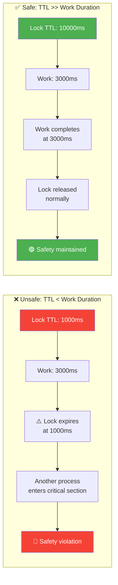

# TTL Expiration Edge Case

## Timeline: Lock Expires Mid-Operation

```mermaid
gantt
    title TTL Edge Case: Lock TTL (1s) < Work Duration (3s)
    dateFormat X
    axisFormat %Lms

    section Process A
    Acquire lock (TTL=1000ms) :milestone, a0, 0, 0
    Work in progress...       :active, a1, 0, 1000
    ⚠️ Lock EXPIRED           :crit, a2, 1000, 3000
    Decrement FAILS           :crit, a3, 3000, 3100

    section Process B
    Waiting for lock...       :done, b0, 0, 1000
    Lock acquired (A expired) :active, b1, 1000, 1100
    Read stock=1              :active, b2, 1100, 1200
    Decrement → stock=0 ✅    :active, b3, 1200, 1400

    section Stock
    stock = 1                 :s1, 0, 1200
    stock = 0 (B decremented) :crit, s2, 1200, 3100
```

## Safe TTL vs Unsafe TTL

## Key Takeaway

| Scenario | TTL | Work Duration | Result |
|----------|-----|---------------|--------|
| **Unsafe** | 1000ms | 3000ms | Lock expires mid-work → safety violation |
| **Safe** | 10000ms | 3000ms | Lock outlives work → correct behavior |
| **Rule of thumb** | `TTL ≥ 3× max_work_duration` | — | Accounts for GC pauses, network latency |
